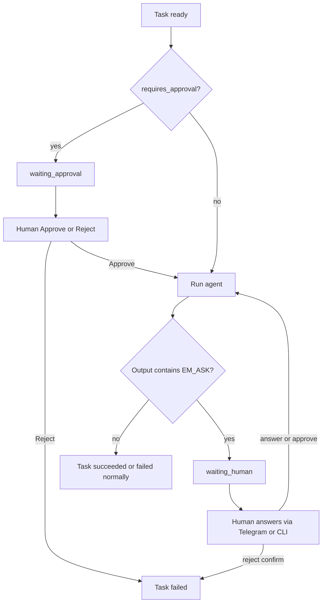

# Remote control, notifications, and human asks

This document describes **everything** about how Engineering Manager (`em`) keeps you informed and can pause for human input — at your desk or remotely via Telegram.

Related quick-start for a hands-on run: [`TESTING-TELEGRAM.md`](TESTING-TELEGRAM.md).

---

## Table of contents

1. [Why this exists](#1-why-this-exists)
2. [Features at a glance](#2-features-at-a-glance)
3. [Concepts](#3-concepts)
4. [Setup (Telegram)](#4-setup-telegram)
5. [Configuration reference](#5-configuration-reference)
6. [Notifications (task and run summaries)](#6-notifications-task-and-run-summaries)
7. [YAML approval gates](#7-yaml-approval-gates)
8. [Agent-raised asks (`EM_ASK`)](#8-agent-raised-asks-em_ask)
9. [Ask types in detail](#9-ask-types-in-detail)
10. [How it works (internals)](#10-how-it-works-internals)
11. [Desk vs remote control](#11-desk-vs-remote-control)
12. [CLI commands](#12-cli-commands)
13. [Status values you will see](#13-status-values-you-will-see)
14. [Files on disk](#14-files-on-disk)
15. [Message formatting](#15-message-formatting)
16. [Security and multi-developer use](#16-security-and-multi-developer-use)
17. [Installer behavior](#17-installer-behavior)
18. [Troubleshooting](#18-troubleshooting)
19. [Examples](#19-examples)

---

## 1. Why this exists

Long multi-agent workflows run for minutes or hours. You should be able to:

- Leave your desk and still know what finished or failed
- Pause risky steps until you confirm
- Let the **agent** ask when it is stuck (missing URL, two design options, yes/no deploy)

`em` acts as the engineering manager: it schedules agents, and when a human is needed it notifies you and waits — then continues with your answer.

---

## 2. Features at a glance

| Feature | What it does |
|---------|----------------|
| **Per-developer Telegram bot** | Each person configures their own bot token; nothing is shared in the public repo |
| **Auto chat-id detection** | After you paste a token and message the bot, `em` finds your chat id |
| **Task completion notify** | After each task ends (succeeded / failed / skipped / cancelled), Telegram gets a short summary |
| **Run completion notify** | When the whole workflow finishes, Telegram gets a rollup |
| **YAML `requires_approval`** | Always pause **before** a task runs until Approve / Reject |
| **Agent `EM_ASK`** | Agent decides mid-task to ask confirm / choice / text; `em` pauses and re-runs with your answer |
| **Desk control** | Same pauses can be resolved with `em approve` / `em reject` / `em answer` |
| **Remote control** | Same pauses can be resolved from Telegram (buttons or replies) |
| **Formatted messages** | HTML bold/italic + cleaned agent markdown (tables flattened, `**` stripped) |
| **Optional toggles** | Turn task/run notifications on or off in config without removing the bot |

---

## 3. Concepts

### Two layers of human input

| Layer | Who decides | When it fires | Typical use |
|-------|-------------|-----------------|-------------|
| **YAML gate** | You (workflow author) | Before the task starts | Always approve deploy / merge / review |
| **Agent ask** | The AI agent | After a task run that printed `EM_ASK` | Missing info, product choice, confirmation |

You normally want **both**: hard rules in YAML, judgment questions from the agent.

### Desk vs remote

Both layers share the same wait/decision channel:

- **Desk** — second terminal (or same machine) using CLI commands  
- **Remote** — Telegram bot chat on your phone  

First valid answer wins; the scheduler continues.

---

## 4. Setup (Telegram)

### Prerequisites

- `em` installed from a build that includes remote control (this feature branch or a release that has it)
- Telegram app on your phone
- Optional: Cursor / Claude / etc. logged in for real agent runs

### Steps (minimal)

1. Open Telegram → [@BotFather](https://t.me/BotFather) → `/newbot` → copy the **HTTP API token**
2. Run:

```bash
em config telegram
```

3. Paste the token when prompted  
4. When `em` asks: open **your new bot** and send any message (e.g. `hi`)  
5. `em` detects your **chat id**, writes `~/.em/config.yaml`, and sends a setup message  

Verify anytime:

```bash
em config show
em notify test
em doctor          # shows Telegram configured / missing
```

### Manual chat id (only if auto-detect fails)

Your chat id is the numeric id of your **private chat with the bot**.

Fallback:

1. Message [@userinfobot](https://t.me/userinfobot) and copy your Id, **or**
2. Pass it explicitly:

```bash
em config telegram --token YOUR_TOKEN --chat-id YOUR_CHAT_ID
```

### Clear Telegram settings

```bash
em config clear telegram
```

---

## 5. Configuration reference

### File location

`~/.em/config.yaml` (user-global, **never commit** this file).

Example shape:

```yaml
telegram:
  bot_token: "123456:ABC..."
  chat_id: "987654321"
  allowed_chat_ids:
    - "987654321"
notify:
  on_task_complete: true
  on_run_complete: true
```

### Environment overrides

| Variable | Meaning |
|----------|---------|
| `EM_TELEGRAM_BOT_TOKEN` | Overrides bot token for this process |
| `EM_TELEGRAM_CHAT_ID` | Overrides chat id; also added to allowlist |
| `EM_SKIP_TELEGRAM=1` | Installer skips the optional Telegram prompt |

### Allowlist

Only Telegram updates from `allowed_chat_ids` (plus your configured `chat_id`) are accepted for Approve / Reject / answers. Other chats are ignored.

### Notification toggles

| Key | Default | Meaning |
|-----|---------|---------|
| `notify.on_task_complete` | `true` | Send a message when each task reaches a terminal status |
| `notify.on_run_complete` | `true` | Send a message when the whole run finishes |

If Telegram is not configured, notifications are silently skipped (runs still succeed).

---

## 6. Notifications (task and run summaries)

### When they fire

**After a task** reaches one of:

- `succeeded`
- `failed`
- `skipped`
- `cancelled`

(Not while `pending` / `running` / waiting for human.)

**After a run** reaches `succeeded`, `failed`, or `cancelled`.

### What you see

Task messages include:

- Status icon (e.g. ✅ / ❌ / ⏭️)
- Task id and status
- Run id
- Cleaned summary text (agent markdown flattened)

Run messages include:

- Overall status
- Workflow name + run id
- Counts per status (e.g. ✅ 4 succeeded · ⏭️ 1 skipped)

### Notify failures never fail the run

If Telegram is down or the token is wrong, `em` logs a warning and continues the workflow.

---

## 7. YAML approval gates

### Syntax

```yaml
tasks:
  - id: review
    agent: reviewer
    depends_on: [qa]
    when: on_upstream_success
    requires_approval: true
    prompt: |
      Review the feature and write docs/REVIEW.md …
```

### Behavior

1. Dependencies finish and `when` allows the task  
2. Task becomes ready but **does not start the agent yet**  
3. Status → `waiting_approval`  
4. Telegram (if configured) gets Approve / Reject buttons  
5. On **Approve** → task runs normally  
6. On **Reject** → task is marked `failed` with a clear summary  

This is a **policy** gate: it always happens when the flag is set, regardless of what the agent would have done.

### Desk commands

```bash
em status
em approve <run_id> review
em reject <run_id> review --reason "Not ready"
```

### Telegram

- Tap **Approve** / **Reject**, or  
- Reply `approve` / `yes` / `reject` / `no`

---

## 8. Agent-raised asks (`EM_ASK`)

### Idea

While an agent is working, it may realize it needs a human. Instead of guessing, it prints a single structured line and stops. `em` detects that, pauses, asks you, then **re-runs the same task** with your answer injected into the prompt.

### Protocol

Agents are automatically given short instructions (appended to non-shell prompts) that describe this format. They should print **exactly one** of:

```text
EM_ASK:{"type":"confirm","question":"Short yes/no question"}
EM_ASK:{"type":"choice","question":"Pick one","options":["Option A","Option B"]}
EM_ASK:{"type":"text","question":"What value should I use for X?"}
```

Rules for agents:

- Print `EM_ASK:…` only when input is truly required  
- Prefer a short question  
- For `choice`, provide at least two options  
- Stop after printing `EM_ASK` (do not continue as if answered)

### Detection

`em` scans the agent **summary** and **raw output** for the last `EM_ASK:{…}` JSON object. If found and the agent exit is treated as success, the task does **not** stay succeeded — it moves to `waiting_human`.

### After you answer

1. Your answer is stored on the task (`human_answer`)  
2. The task is re-executed with the original prompt **plus** a block like:

```text
---
Human operator response to your previous question:
<your answer>
Continue the task using this answer. Do not ask the same question again
unless you still lack required information.
```

3. If the agent asks again with a new `EM_ASK`, the pause cycle can repeat  

### Desk command for answers

```bash
em answer <run_id> <task_id> --text "GraphQL"
# or
em answer <run_id> <task_id> -t "https://staging.example.com"
```

For confirm-style agent asks, you can also use `em approve` / `em reject`.

---

## 9. Ask types in detail

### `confirm` (yes / no)

**JSON**

```text
EM_ASK:{"type":"confirm","question":"Deploy to production now?"}
```

**Telegram**

- Buttons: Approve / Reject  
- Or reply: `yes` / `no` / `approve` / `reject`

**Desk**

```bash
em approve <run_id> <task_id>
em reject <run_id> <task_id>
```

**Effect**

- Approve → resume / continue (for YAML gate: start the task; for agent ask: re-run with answer `approved`)  
- Reject → task `failed`

### `choice` (pick one option)

**JSON**

```text
EM_ASK:{"type":"choice","question":"Which API style?","options":["REST","GraphQL"]}
```

**Telegram**

- One button per option (up to 8)  
- Or reply with the option text, or `1` / `2` / … (1-based index)

**Desk**

```bash
em answer <run_id> <task_id> --text "GraphQL"
```

**Effect**

- Selected option text is injected as the human answer; task re-runs  

### `text` (free-form)

**JSON**

```text
EM_ASK:{"type":"text","question":"What is the staging base URL?"}
```

**Telegram**

- Reply with any non-empty message (that becomes the answer)

**Desk**

```bash
em answer <run_id> <task_id> --text "https://staging.example.com"
```

**Effect**

- Your text is injected; task re-runs  

### YAML gate vs agent ask

| | YAML `requires_approval` | Agent `EM_ASK` |
|--|--------------------------|----------------|
| Timing | Before agent starts | After an agent turn that printed `EM_ASK` |
| Types | Always confirm | confirm / choice / text |
| On approve | Start agent | Re-run agent with answer |
| On reject | Fail task | Fail task |

---

## 10. How it works (internals)

### High-level flow



### Decision channel

While waiting, `em` polls:

1. A JSON reply file under `.em/approvals/<run_id>/`  
2. Telegram `getUpdates` (if configured), writing the same reply file when you tap a button or reply  

CLI commands only write the reply file; the running `em run` process picks it up within about half a second.

### Prompt injection for agents

For non-`shell` tasks with a non-empty prompt, `em` appends `EM_ASK` instructions so models know the protocol without you copy-pasting it into every YAML prompt.

---

## 11. Desk vs remote control

| Action | Desk | Telegram |
|--------|------|----------|
| Approve YAML gate | `em approve <run> <task>` | Approve button / `approve` |
| Reject YAML gate | `em reject <run> <task>` | Reject button / `reject` |
| Answer choice/text | `em answer <run> <task> -t "…"` | Button / number / free text |
| See run id | `em status` | Included in every notify message |

You can mix: start the run at your laptop, approve from your phone.

The machine running `em run` must stay awake (or the process must keep running) for remote answers to be applied.

---

## 12. CLI commands

| Command | Purpose |
|---------|---------|
| `em config telegram` | Interactive setup (token → auto chat id → test message) |
| `em config telegram --token … [--chat-id …]` | Non-interactive setup |
| `em config show` | Show config with token redacted |
| `em config clear telegram` | Remove Telegram settings |
| `em notify test` | Send a test ping |
| `em doctor` | Includes Telegram configured / missing |
| `em approve <run_id> <task_id>` | Approve a waiting gate / confirm ask |
| `em reject <run_id> <task_id> [--reason …]` | Reject |
| `em answer <run_id> <task_id> --text …` | Answer choice or text ask |
| `em status` / `em status <run_id>` | See statuses including `waiting_approval` / `waiting_human` |
| `em resume` | Resume interrupted runs (waiting tasks re-enter the wait) |
| `em cancel <run_id>` | Cancel pending / waiting / running work |

Useful flags: `--state-dir` on approve / reject / answer / status when state is not under `./.em`.

---

## 13. Status values you will see

| Status | Meaning |
|--------|---------|
| `pending` | Not ready yet (deps unfinished) |
| `ready` | Eligible to start |
| `waiting_approval` | YAML gate — waiting for Approve / Reject |
| `waiting_human` | Agent asked a question — waiting for answer |
| `running` | Agent / command in progress |
| `succeeded` | Finished OK |
| `failed` | Failed or human rejected |
| `skipped` | Skipped by `when` / deps |
| `cancelled` | Cancelled by user / interrupt while waiting |

Live board and `em status` show these with distinct colors.

---

## 14. Files on disk

Under the project `cwd` (default):

```text
.em/
  latest
  runs/<run_id>.json          # run + task state
  logs/<run_id>/<task>.log    # agent logs
  approvals/<run_id>/
    <task_id>.ask.json        # pending ask payload (type, question, options)
    <task_id>.json            # human reply (approve / reject / answer)
```

User config (not in the project):

```text
~/.em/config.yaml
```

---

## 15. Message formatting

Telegram messages use `parse_mode=HTML` for bold / italic / code.

Agent summaries often contain Markdown tables and `**bold**`. Before sending, `em`:

- Strips `**` and backticks  
- Turns `| cell | cell |` table rows into `• cell — cell`  
- Drops markdown table separator lines  
- Removes `#` heading markers  
- Truncates long text  

So phone messages stay readable even when agents write Markdown reviews.

---

## 16. Security and multi-developer use

- **Never commit** tokens or `~/.em/config.yaml`  
- **One bot per developer** for open-source / shared repos — do not put a shared bot token in the README  
- Only allowlisted chat ids can approve or answer  
- Prefer not to put production secrets in Telegram replies when avoidable (use desk `em answer` on a trusted machine if needed)  
- Anyone with your bot token can send as the bot — treat the token like a password  

---

## 17. Installer behavior

After installing `em`, `install.sh` / `install.ps1` optionally ask:

```text
Set up Telegram now? [y/N]
```

- **Y** → prompt for token (and optional chat id), then call `em config telegram`  
- **N** or non-interactive / `EM_SKIP_TELEGRAM=1` → skip; use `em config telegram` later  

Telegram is never required to install or use `em`.

---

## 18. Troubleshooting

| Symptom | What to try |
|---------|-------------|
| `No such command 'config'` | Old `em` binary — use this branch’s venv: `pip install -e .` and `which em` |
| `em notify test` fails | `em config show`; re-run `em config telegram`; message the bot once |
| No task summaries | Telegram configured? `notify.on_task_complete` true? Run still using new `em`? |
| Approve does nothing | Is `em run` still active? Correct `run_id` / task id? Check `.em/approvals/…` |
| Agent never asks | Prompt non-empty and provider not `shell`? Model must print `EM_ASK:…` exactly |
| Choice button ignored | Reply file may be stale; ensure run is in `waiting_human` |
| Interrupted while waiting | `em resume` — waiting tasks go back to pending and re-enter the wait |

---

## 19. Examples

### Always approve before review

```yaml
  - id: review
    agent: reviewer
    depends_on: [qa]
    when: on_upstream_success
    requires_approval: true
    prompt: |
      Write docs/REVIEW.md …
```

### Agent asks which option (no YAML gate required)

The agent prints during its turn:

```text
EM_ASK:{"type":"choice","question":"Checkout button label?","options":["Buy now","Place order"]}
```

You answer on Telegram or:

```bash
em answer run_abc123 implement-ui --text "Place order"
```

### Full hands-on test

Follow [`TESTING-TELEGRAM.md`](TESTING-TELEGRAM.md): install from scratch → configure Telegram → run the Flutter sample with `requires_approval: true` on `review`.
